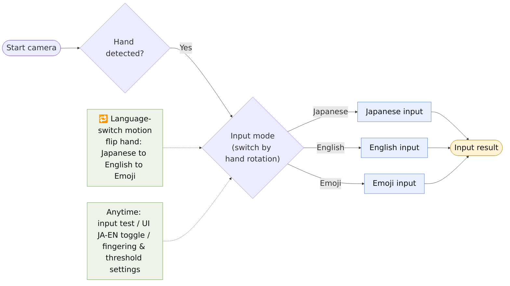

# Application Flow (how it works)

A **high-level view** of the `demo-app` Web demo from the user's side: start camera → detect hand → input mode (rotate the hand to cycle Japanese / English / Emoji) → **three input paths** → input result.

> Code structure (per-mode implementation flow): [`implementation.en.md`](implementation.en.md) ｜ 日本語: [`application.md`](application.md)

Image: [PNG (white bg, 16:9, for slides)](figs/application.en.png) ｜ source [`application.en.mmd`](application.en.mmd) (Mermaid, landscape LR)

## Notes
- **Three input paths: Japanese / English / Emoji.** The concrete input mechanics (fingering, flicks, etc.) may change, so they are omitted here; the implementation detail lives in [`implementation.en.md`](implementation.en.md).
- **Rotate the hand (palm → back) to cycle modes.** No switching while folding fingers to type; input is paused briefly right after a switch.
- **Always available**: input test (metrics) / UI JA-EN toggle / fingering & threshold settings.
