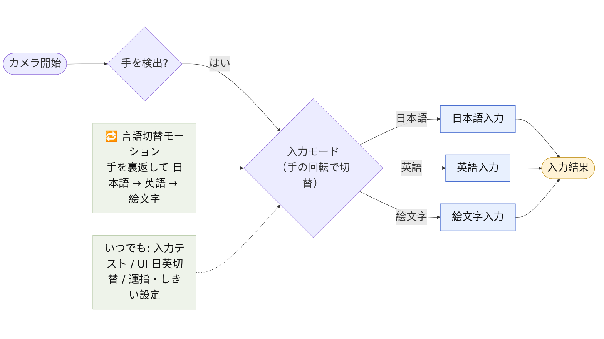

# アプリケーション・フロー図（操作の流れ）

`demo-app` ブランチの Web デモを**使う側から見た高レベルの流れ**。カメラ起動 → 手を検出 → 入力モード（手の回転で 日本語 / 英語 / 絵文字 を切替）→ **3つの入力経路** → 入力結果。

> コード構成（モード別の実装フロー）は [`implementation.md`](implementation.md) を参照 ｜ English: [`application.en.md`](application.en.md)

画像: [PNG（白背景・16:9・スライド向け）](figs/application.png) ｜ ソース [`application.mmd`](application.mmd)（Mermaid・横長 LR）

## 補足
- **入力経路は 日本語 / 英語 / 絵文字 の3つ**。それぞれの具体的な入力機構（運指・フリック等）は変更の可能性があるためこの図では省略し、実装の詳細は [`implementation.md`](implementation.md) 側に分けている。
- **手の回転（手のひら→甲）でモードを巡回**。指を折って入力中は切替しない。切替直後は一定時間 入力を止める。
- **いつでも使える機能**: 入力テスト（計測）/ UI 日英切替 / 運指・しきい値の設定。
