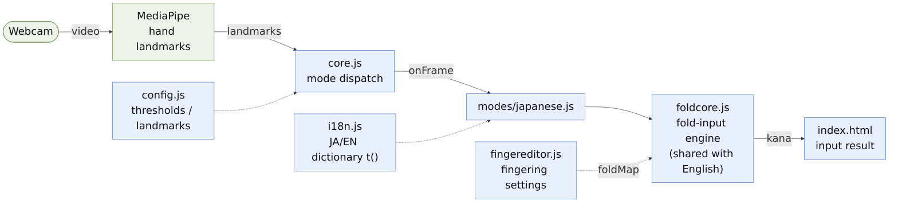
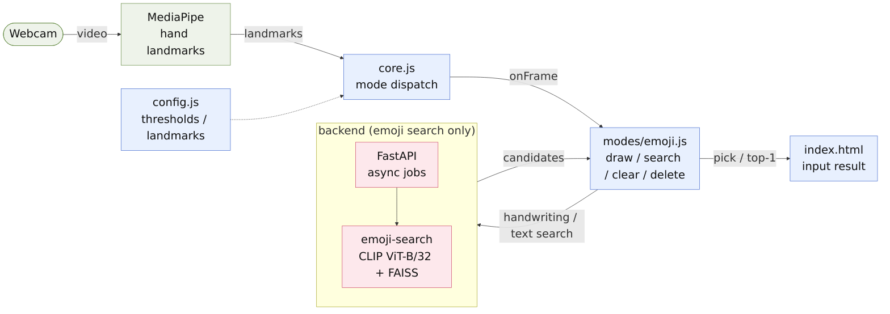

# Implementation Architecture (per-mode flow)

The `demo-app` implementation split into three modes — **Japanese / English / Emoji** — as a "read → output" flow.
Input reading (hand detection → gesture/flick interpretation → character commit) runs entirely in the browser front-end (ES modules); the backend is used only for emoji search.

> Application flow / features: [`application.en.md`](application.en.md) ｜ 日本語: [`implementation.md`](implementation.md)

## Japanese input (front-end only)

## English input (front-end only; engine shared with Japanese)

## Emoji input (backend used only for search)

## Legend
- **Green**: external / input source (camera, MediaPipe). **Blue**: front-end (ES modules). **Red**: backend (emoji search only).
- Solid `→`: data/control flow. Dotted `⇢`: dependency (`config` ref / `i18n` `t()` / `fingereditor` `foldMap`).
- Japanese and English share the common `foldcore.js` (fold-input engine) and are front-end only; only emoji calls the backend (CLIP + FAISS).
- Images are white-background PNG (for slides). Mermaid sources: `implementation-japanese.en.mmd` / `implementation-english.en.mmd` / `implementation-emoji.en.mmd`.
