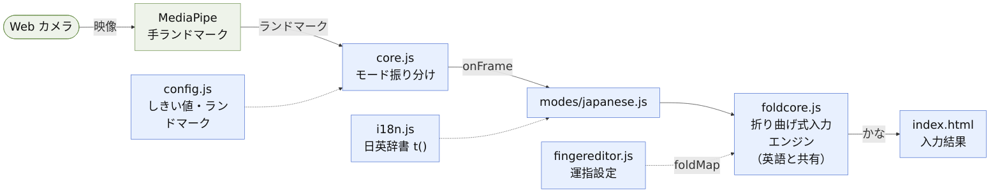
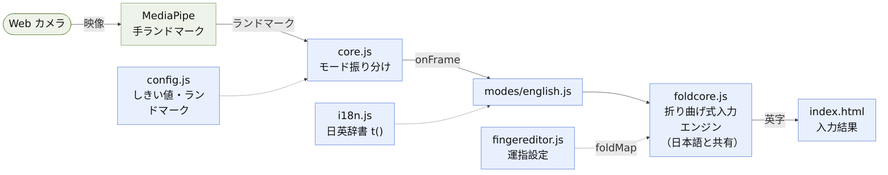
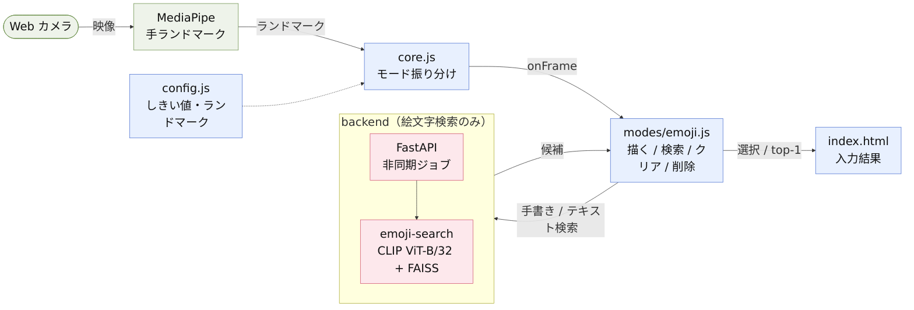

# 実装アーキテクチャ図（モード別フロー）

`demo-app` ブランチの実装を **日本語 / 英語 / 絵文字** の3モードに分けた「読み取り → 出力」のフロー。
読み取り（手検出 → ジェスチャ/フリック解釈 → 文字確定）はブラウザのフロント（ES modules）で完結し、backend を使うのは絵文字検索だけ。

> アプリとしての操作フロー・できることは [`application.md`](application.md) を参照 ｜ English: [`implementation.en.md`](implementation.en.md)

## 日本語入力（フロント完結）

## 英語入力（フロント完結・エンジンは日本語と共有）

## 絵文字入力（検索のみ backend を利用）

## 凡例
- **緑**: 外部/入力源（カメラ・MediaPipe）。**青**: フロント実装（ES modules）。**赤**: backend（絵文字検索のみ）。
- 実線 `→`: データ/制御の流れ。点線 `⇢`: 依存（`config` 参照 / `i18n` の `t()` / `fingereditor` の `foldMap`）。
- 日本語・英語は共通の `foldcore.js`（折り曲げ式入力エンジン）を使い front 完結。絵文字だけ backend（CLIP + FAISS）を叩く。
- 画像は白背景 PNG（スライド向け）。各図の Mermaid ソースは `implementation-japanese.mmd` / `implementation-english.mmd` / `implementation-emoji.mmd`。
